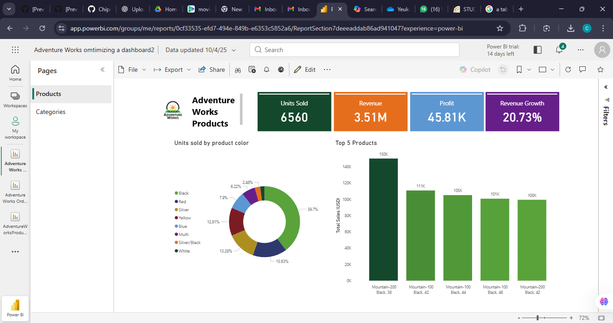

# Adventure-Works-Optimizing-a-Dashboard
A Power BI dashboard optimized for performance and clarity, showcasing product, category, and sales insights using advanced visualization and redesign techniques. It includes redesigned visuals, enhanced layout structure, and refined metrics for better analytical decision-making.

🖼️ Preview

🔍 Project Overview

This dashboard was created as part of a the Microsofte Power BI Certificate focused on dashboard optimization techniques, including:

Improving visual hierarchy
Enhancing user experience through better organization
Reducing clutter for a cleaner analytic flow
Optimizing performance by minimizing unnecessary visuals
Using meaningful KPIs and relevant chart types

📊 Key Insights

Products Page
Total Units Sold, Revenue, Profit, and Revenue Growth KPIs
Sales distribution by product color
Top 5 best-selling products

Categories Page

Product table with units sold and total sales
Sales and profit distribution by category
Detailed sales by sub-category

🧰 Tools Used

Power BI Desktop
Visualization customization
Power BI Service (for publishing)

📁 Files Included

Adventure_Works_Optimized_Dashboard.pbix – Full Power BI report
Adventure_Works_Optimizing_a_Dashboard1.png – Screenshot (Products Page)
Adventure_Works_Optmizing_a_Dashboard2.png – Screenshot (Categories Page)

✨ Features

Clean and responsive layout
Focused KPI storytelling
Optimized visuals for speed and readability
Consistent color themes and formatting
Dynamic filters and interactive elements

🚀 Purpose

To demonstrate competency in:

Power BI dashboard design
Data analysis and storytelling
Optimization and visual communication
